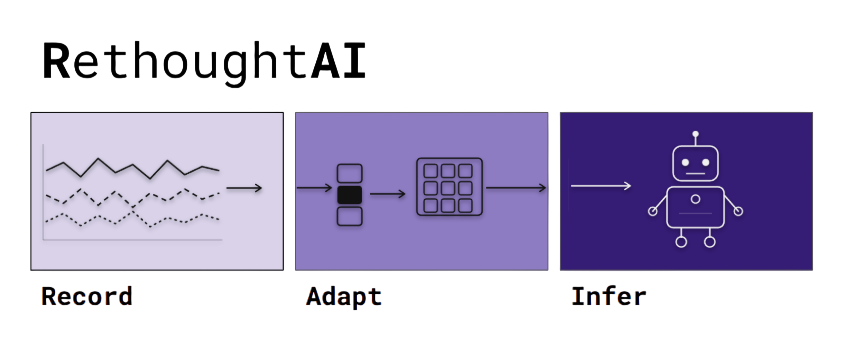

# RethoughtAI

**RAI - Record · Adapt · Infer**

A ROS2-native pipeline for robot learning. Collect demonstrations, convert to training-ready datasets, and deploy trained policies — without leaving ROS2.



---

## Why

RAI is a 3 step pipeline for learning from demonstrations with ROS2: record, adapter, and inference. Each package is designed to be modular and extensible, so you can use the whole pipeline or just the pieces you need.

---

## The Pipeline

```
recorder  →  adapter  →  inference
 record       convert      deploy
 demos        to LeRobot   policy
```

**[recorder](recorder/)** - Record demonstrations to MCAP with live Rerun visualization. Trigger via physical buttons (Baxter, Sawyer) or keyboard (any robot).

**[adapter](adapter/)** - Convert MCAP recordings to LeRobot v3 datasets, quality-filter episodes, and push to HuggingFace Hub.

**[inference](inference/)** - Deploy a trained policy from HuggingFace back to your ROS2 robot.

---

## Supported Robots

| Robot | Config | Trigger |
|---|---|---|
| Baxter | [baxter.yaml](recorder/configs/baxter.yaml) | Digital IO buttons |
| Sawyer | coming soon | Digital IO buttons |
| Generic ROS2 | [generic.yaml](recorder/configs/generic.yaml) | Keyboard |

---

## Installation

Requires [uv](https://docs.astral.sh/uv/).

```bash
git clone https://github.com/RethoughtRobotics/RethoughtAI.git
cd RethoughtAI
uv sync
```

All three packages are installed into a single virtual environment. Use `uv run` to invoke any command.

```bash
uv run recorder --help
uv run adapter --help
uv run inference --help
```

---

## Quick Start

```bash
# 1. Record demonstrations
recorder record --config recorder/configs/baxter.yaml

# 2. Convert to LeRobot dataset
adapter convert --config recorder/configs/baxter.yaml --input ./recordings --push-to-hub yourname/your-dataset

# 3. Train with LeRobot (standard LeRobot workflow)
# https://github.com/huggingface/lerobot

# 4. Deploy policy (coming soon)
# inference run --config recorder/configs/baxter.yaml --model yourname/your-model
```

---

## Part of Rethought Robotics

RAI is part of the [Rethought Robotics](https://github.com/RethoughtRobotics) ecosystem — bringing Baxter and Sawyer into the modern robotics stack.

| Repo | What it does |
|---|---|
| [baxter-zenoh](https://github.com/RethoughtRobotics/baxter-zenoh) | ROS2 bridge for Baxter |
| [BaxterSDK](https://github.com/RethoughtRobotics/BaxterSDK) | Tools, MoveIt2, pre-made scripts |
| **RethoughtAI** | Robot learning pipeline |
