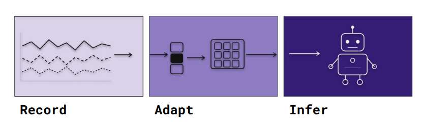

<h1 align="center">RethoughtAI</h1>

<p align="center"><b>RAI - Record · Adapt · Infer</b></p>

<p align="center">
  A ROS2-native pipeline for robot learning. Collect demonstrations, convert to training-ready datasets, and deploy trained policies.
</p>

<p align="center">
  
  

</p>

---

## About

RAI is a 3-step pipeline for learning from demonstrations with ROS2: record, adapt, and infer.

---

## The Pipeline

<p align="center">
  
</p>

**[recorder](recorder/)** — Record demonstrations to MCAP with live Rerun visualization. Trigger via physical buttons (Baxter, Sawyer) or keyboard (any robot).

**[adapter](adapter/)** — Convert MCAP recordings to LeRobot v3 datasets, quality-filter episodes, and push to HuggingFace Hub.

**[inference](inference/)** — Deploy a trained policy from HuggingFace back to your ROS2 robot.

---

## Supported Robots

| Robot | Config | Trigger |
|---|---|---|
| Baxter | [baxter.yaml](recorder/configs/baxter.yaml) | Digital IO buttons |
| Sawyer | coming soon | Digital IO buttons |
| Generic ROS2 | [generic.yaml](recorder/configs/generic.yaml) | Keyboard |

---

## Installation

Requires [uv](https://docs.astral.sh/uv/).

```bash
git clone https://github.com/RethoughtRobotics/RethoughtAI.git
cd RethoughtAI
uv sync
```

All three packages install into a single virtual environment.

```bash
uv run recorder --help
uv run adapter --help
uv run inference --help
```

---

## Quick Start

```bash
# 1. Record demonstrations
uv run recorder record --config recorder/configs/baxter.yaml

# 2. Convert to LeRobot dataset and push to HuggingFace
uv run adapter convert --config recorder/configs/baxter.yaml \
  --input ./recordings \
  --push-to-hub yourname/your-dataset

# 3. Train with LeRobot (standard LeRobot workflow)
# https://github.com/huggingface/lerobot

# 4. Deploy policy (coming soon)
# uv run inference run --config recorder/configs/baxter.yaml --model yourname/your-model
```

---

## Part of Rethought Robotics

<p>
  <a href="https://github.com/RethoughtRobotics/baxter-zenoh">
    
  </a>
  <a href="https://github.com/RethoughtRobotics/BaxterSDK">
    
  </a>
</p>
